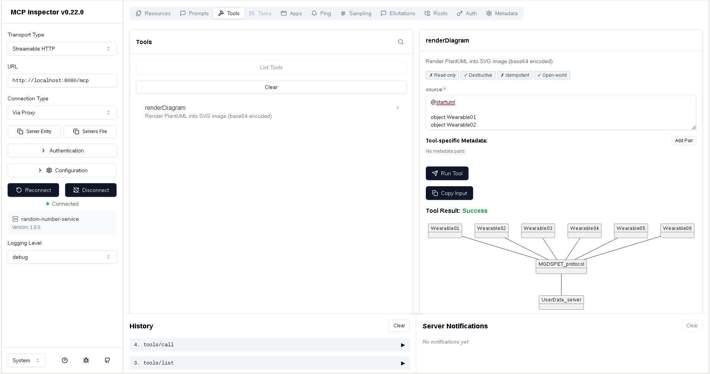

# PlantUML MCP Server

A Model Context Protocol (MCP) server that renders [PlantUML](https://plantuml.com/) diagrams into SVG images. Built with Spring Boot and Spring AI.

## Demo



*MCP Inspector v0.22.0 connected to the server, rendering a PlantUML object diagram to SVG*

## Features

- Exposes a `renderDiagram` tool via MCP Streamable HTTP transport
- Accepts PlantUML source text and returns base64-encoded SVG images
- Works with any MCP-compatible client (e.g., MCP Inspector, Claude Desktop)

## Requirements

- Java 21+
- Spring Boot 4.1.0
- Spring AI 2.0.0

## Build

```bash
./gradlew bootJar
```

## Run

```bash
java -jar build/libs/mcp-spring-ai-0.0.1-SNAPSHOT.jar
```

The server starts on port **8080** with the MCP endpoint at `http://localhost:8080/mcp`.

## Usage

Send a `tools/call` request to the MCP endpoint:

```json
{
  "method": "tools/call",
  "params": {
    "name": "renderDiagram",
    "arguments": {
      "source": "@startuml\nAlice -> Bob : hello\n@enduml"
    }
  }
}
```

Returns base64-encoded SVG content with MIME type `image/svg+xml`.

## Testing with MCP Inspector

1. Open [MCP Inspector](https://modelcontextprotocol.github.io/inspector/) (v0.22.0+)
2. Set Transport Type to **Streamable HTTP**
3. Enter URL: `http://localhost:8080/mcp`
4. Connect and call the `renderDiagram` tool with your PlantUML source:

```
@startuml
Alice -> Bob : Hello
@enduml
```


